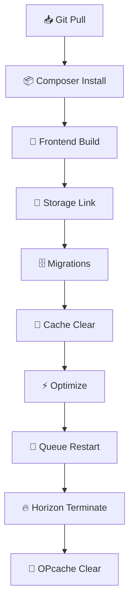

<div align="center">

  <!-- Logo/Icon -->
  

  # 🚀 Laravel Hosting Deploy

  ### A universal deployment tool for Laravel to any shared hosting or VPS via SSH with GitHub Actions support

  [](https://packagist.org/packages/arseno25/laravel-hosting-deploy)
  [](https://packagist.org/packages/arseno25/laravel-hosting-deploy)
  [](https://github.com/Arseno25/laravel-hosting-deploy/blob/main/LICENSE.md)
  [](https://packagist.org/packages/arseno25/laravel-hosting-deploy)
  [](https://laravel.com)

  <!-- Links -->
  [](https://github.com/Arseno25/laravel-hosting-deploy/stargazers)
  [](https://github.com/Arseno25/laravel-hosting-deploy/network/members)
  [](https://github.com/Arseno25/laravel-hosting-deploy/issues)

</div>

---

## ✨ Features

<table>
<tr>
<td width="50">

🔐

</td>
<td>

<b>SSH Key Authentication</b> - Secure deployment using SSH keys (recommended) or password authentication

</td>
</tr>
<tr>
<td width="50">

🤖

</td>
<td>

<b>GitHub Actions Integration</b> - Automatically set up CI/CD workflows with GitHub Actions

</td>
</tr>
<tr>
<td width="50">

🔗

</td>
<td>

<b>GitHub API Integration</b> - Automatically manage deploy keys and secrets

</td>
</tr>
<tr>
<td width="50">

⚙️

</td>
<td>

<b>Flexible Deployment Options</b> - Fresh deployments, storage linking, frontend building

</td>
</tr>
<tr>
<td width="50">

👁️

</td>
<td>

<b>Dry Run Mode</b> - Preview deployment scripts before executing

</td>
</tr>
<tr>
<td width="50">

🚀

</td>
<td>

<b>Automatic Setup</b> - One-command setup for SSH keys and GitHub secrets

</td>
</tr>
<tr>
<td width="50">

🧪

</td>
<td>

<b>Testing Integration</b> - Built-in PHPUnit and PHPStan support

</td>
</tr>
<tr>
<td width="50">

💾

</td>
<td>

<b>Multiple Cache Management</b> - Config, route, view, and event caching

</td>
</tr>
<tr>
<td width="50">

🔄

</td>
<td>

<b>Queue & Horizon Support</b> - Automatic queue worker restart and Horizon termination

</td>
</tr>
</table>

## 📋 Requirements

- **PHP:** 8.1 or higher
- **Laravel:** 10, 11, or 12
- **Server:** SSH access to your server
- **GitHub:** Account with repository access

## 📦 Installation

Install the package via Composer:

```bash
composer require arseno25/laravel-hosting-deploy
```

The package will automatically register its service provider.

## ⚙️ Configuration

<div align="center">

```bash
php artisan vendor:publish --tag="hosting-deploy-config"
```

</div>

This will create a <code>config/hosting-deploy.php</code> file where you can customize all settings.

### Environment Variables

Add the following variables to your <code>.env</code> file:

<table>
<tr>
<td colspan="3">

<b>🖥️ Server Credentials</b>

</td>
</tr>
<tr>
<td>

<code>DEPLOY_HOST</code>

</td>
<td colspan="2">

Your server hostname or IP address

</td>
</tr>
<tr>
<td>

<code>DEPLOY_PORT</code>

</td>
<td colspan="2">

SSH port (default: <code>22</code>)

</td>
</tr>
<tr>
<td>

<code>DEPLOY_USERNAME</code>

</td>
<td colspan="2">

SSH username

</td>
</tr>
<tr>
<td>

<code>DEPLOY_PASSWORD</code>

</td>
<td colspan="2">

SSH password (optional, use SSH key instead)

</td>
</tr>
<tr>
<td>

<code>DEPLOY_SSH_KEY_PATH</code>

</td>
<td colspan="2">

Path to SSH private key (optional)

</td>
</tr>
</table>

<table>
<tr>
<td colspan="3">

<b>⚙️ Deployment Settings</b>

</td>
</tr>
<tr>
<td>

<code>DEPLOY_PROJECT_DIR</code>

</td>
<td colspan="2">

Absolute path to your project on the server

</td>
</tr>
<tr>
<td>

<code>DEPLOY_COMPOSER_FLAGS</code>

</td>
<td colspan="2">

Composer flags (default: <code>--no-dev --optimize-autoloader</code>)

</td>
</tr>
<tr>
<td>

<code>DEPLOY_RUN_MIGRATIONS</code>

</td>
<td>

Run migrations on deploy

</td>
<td>

<code>true</code>

</td>
</tr>
<tr>
<td>

<code>DEPLOY_RUN_SEEDERS</code>

</td>
<td>

Run seeders on deploy

</td>
<td>

<code>false</code>

</td>
</tr>
<tr>
<td>

<code>DEPLOY_CLEAR_CACHE</code>

</td>
<td>

Clear cache on deploy

</td>
<td>

<code>true</code>

</td>
</tr>
<tr>
<td>

<code>DEPLOY_OPTIMIZE</code>

</td>
<td>

Optimize on deploy

</td>
<td>

<code>true</code>

</td>
</tr>
</table>

<table>
<tr>
<td colspan="3">

<b>🚀 Deployment Options</b>

</td>
</tr>
<tr>
<td>

<code>DEPLOY_FRESH</code>

</td>
<td>

Reset database on deploy

</td>
<td>

<code>false</code>

</td>
</tr>
<tr>
<td>

<code>DEPLOY_LINK_STORAGE</code>

</td>
<td>

Create storage link

</td>
<td>

<code>true</code>

</td>
</tr>
<tr>
<td>

<code>DEPLOY_BUILD_FRONTEND</code>

</td>
<td>

Build frontend assets

</td>
<td>

<code>true</code>

</td>
</tr>
</table>

<table>
<tr>
<td colspan="3">

<b>🐙 GitHub Settings</b>

</td>
</tr>
<tr>
<td>

<code>DEPLOY_GITHUB_TOKEN</code>

</td>
<td colspan="2">

GitHub fine-grained personal access token

</td>
</tr>
<tr>
<td>

<code>DEPLOY_REPO</code>

</td>
<td colspan="2">

GitHub repository format: <code>username/repo-name</code>

</td>
</tr>
<tr>
<td>

<code>DEPLOY_DEFAULT_BRANCH</code>

</td>
<td colspan="2">

Default branch to deploy

</td>
</tr>
</table>

## 🚀 Usage

### Quick Start - One Command Setup & Deploy

The fastest way to get started is using the all-in-one command:

```bash
php artisan hosting-deploy:all
```

<table>
<tr>
<td>

1️⃣

</td>
<td>

Generate SSH key pair

</td>
</tr>
<tr>
<td>

2️⃣

</td>
<td>

Add deploy key to GitHub repository

</td>
</tr>
<tr>
<td>

3️⃣

</td>
<td>

Store private key locally

</td>
</tr>
<tr>
<td>

4️⃣

</td>
<td>

Add public key to server's authorized_keys

</td>
</tr>
<tr>
<td>

5️⃣

</td>
<td>

Set GitHub secrets for deployment

</td>
</tr>
<tr>
<td>

6️⃣

</td>
<td>

Create GitHub Actions workflow

</td>
</tr>
<tr>
<td>

7️⃣

</td>
<td>

Deploy your application

</td>
</tr>
</table>

### Deploy via CLI

<table>
<tr>
<td>

```bash
# Standard deployment
php artisan hosting-deploy:run
```

</td>
</tr>
<tr>
<td>

```bash
# Fresh deployment (resets database)
php artisan hosting-deploy:run --fresh
```

</td>
</tr>
<tr>
<td>

```bash
# Skip storage linking
php artisan hosting-deploy:run --no-storage
```

</td>
</tr>
<tr>
<td>

```bash
# Skip frontend building
php artisan hosting-deploy:run --no-frontend
```

</td>
</tr>
<tr>
<td>

```bash
# Preview deployment script without executing
php artisan hosting-deploy:run --dry-run
```

</td>
</tr>
<tr>
<td>

```bash
# Show full error output (useful for debugging)
php artisan hosting-deploy:run --show-errors
```

</td>
</tr>
</table>

### Command Options

<table>
<tr>
<th align="left">Option</th>
<th align="left">Description</th>
</tr>
<tr>
<td>

<code>--fresh</code>

</td>
<td>

Perform a fresh deployment (resets database with <code>migrate:fresh</code>)

</td>
</tr>
<tr>
<td>

<code>--no-storage</code>

</td>
<td>

Skip creating storage link

</td>
</tr>
<tr>
<td>

<code>--no-frontend</code>

</td>
<td>

Skip building frontend assets

</td>
</tr>
<tr>
<td>

<code>--dry-run</code>

</td>
<td>

Show the deployment script without executing

</td>
</tr>
<tr>
<td>

<code>--show-errors</code>

</td>
<td>

Display full error output from SSH commands

</td>
</tr>
</table>

---

## 🤖 Automatic CI/CD Setup

The <code>hosting-deploy:setup-cicd</code> command automates the entire CI/CD setup process:

```bash
php artisan hosting-deploy:setup-cicd

# Force overwrite existing secrets
php artisan hosting-deploy:setup-cicd --force

# Skip checking if deploy key already exists
php artisan hosting-deploy:setup-cicd --skip-key-check
```

### What It Does

<table>
<tr>
<td width="50">

🔑

</td>
<td>

<b>Generate SSH Key Pair</b> - Creates a unique ED25519 SSH key pair

</td>
</tr>
<tr>
<td width="50">

🔗

</td>
<td>

<b>Add Deploy Key to GitHub</b> - Registers the public key as a read-only deploy key

</td>
</tr>
<tr>
<td width="50">

💾

</td>
<td>

<b>Store Private Key</b> - Saves the private key securely in <code>storage/app/deploy/</code>

</td>
</tr>
<tr>
<td width="50">

🔐

</td>
<td>

<b>Add to Server</b> - Adds the public key to your server's <code>~/.ssh/authorized_keys</code>

</td>
</tr>
<tr>
<td width="50">

🔒

</td>
<td>

<b>Set GitHub Secrets</b> - Encrypts and sets all required secrets

</td>
</tr>
<tr>
<td width="50">

📝

</td>
<td>

<b>Create Workflow</b> - Generates the GitHub Actions workflow file

</td>
</tr>
</table>

### All-in-One Command

```bash
# Setup CI/CD and deploy in one command
php artisan hosting-deploy:all

# With options
php artisan hosting-deploy:all --fresh --force --show-errors
```

---

## 📝 Manual GitHub Actions Setup

If you prefer to set up GitHub Actions manually:

```bash
php artisan hosting-deploy:github-actions
```

This will create a <code>.github/workflows/hosting-deploy.yml</code> file in your project.

### Required GitHub Secrets

After running the command, add the following secrets to your GitHub repository:

<table>
<tr>
<td colspan="5">

<b>🔐 SSH Key Authentication (Recommended)</b>

</td>
</tr>
<tr>
<td width="150">

<code>DEPLOY_HOST</code>

</td>
<td colspan="4">

Your server hostname or IP address

</td>
</tr>
<tr>
<td width="150">

<code>DEPLOY_PORT</code>

</td>
<td colspan="4">

SSH port (default: <code>22</code>)

</td>
</tr>
<tr>
<td width="150">

<code>DEPLOY_USERNAME</code>

</td>
<td colspan="4">

SSH username

</td>
</tr>
<tr>
<td width="150">

<code>DEPLOY_SSH_KEY</code>

</td>
<td colspan="4">

Your private SSH key content

</td>
</tr>
<tr>
<td width="150">

<code>DEPLOY_PROJECT_DIR</code>

</td>
<td colspan="4">

Absolute path to your project on the server

</td>
</tr>
</table>

<table>
<tr>
<td colspan="5">

<b>🔑 Password Authentication</b>

</td>
</tr>
<tr>
<td width="150">

<code>DEPLOY_HOST</code>

</td>
<td colspan="4">

Your server hostname or IP address

</td>
</tr>
<tr>
<td width="150">

<code>DEPLOY_PORT</code>

</td>
<td colspan="4">

SSH port (default: <code>22</code>)

</td>
</tr>
<tr>
<td width="150">

<code>DEPLOY_USERNAME</code>

</td>
<td colspan="4">

SSH username

</td>
</tr>
<tr>
<td width="150">

<code>DEPLOY_PASSWORD</code>

</td>
<td colspan="4">

SSH password

</td>
</tr>
<tr>
<td width="150">

<code>DEPLOY_PROJECT_DIR</code>

</td>
<td colspan="4">

Absolute path to your project on the server

</td>
</tr>
</table>

---

## 🔑 GitHub Token Setup

You need a fine-grained Personal Access Token from GitHub with the following permissions:

### Required Permissions

<table>
<tr>
<th align="left">Permission</th>
<th align="left">Access Level</th>
</tr>
<tr>
<td>

<b>Repository contents</b>

</td>
<td>

Read and Write

</td>
</tr>
<tr>
<td>

<b>Repository deployments</b>

</td>
<td>

Read and Write

</td>
</tr>
<tr>
<td>

<b>Actions</b>

</td>
<td>

Read and Write (for secrets management)

</td>
</tr>
</table>

### Creating the Token

<ol>
<li>Go to GitHub Settings → Developer settings → Personal access tokens → Fine-grained tokens</li>
<li>Click "Generate new token"</li>
<li>Give it a descriptive name (e.g., "Laravel Deploy")</li>
<li>Set expiration (or no expiration for long-term use)</li>
<li>Select only the <b>specific repository</b> you want to deploy</li>
<li>Grant the permissions listed above</li>
<li>Generate and copy the token</li>
<li>Add it to your <code>.env</code> file as <code>DEPLOY_GITHUB_TOKEN</code></li>
</ol>

<blockquote>

⚠️ <b>Important:</b> The token should only have access to the specific repository you want to deploy, not all your repositories.

</blockquote>

---

## 📦 Deployment Process

The deployment process includes the following steps:



### Detailed Steps

<table>
<tr>
<td width="50">

1️⃣

</td>
<td>

<b>📥 Git Pull</b> - Fetches latest code from your GitHub repository

</td>
</tr>
<tr>
<td width="50">

2️⃣

</td>
<td>

<b>📦 Composer Install</b> - Installs PHP dependencies with optimization flags

</td>
</tr>
<tr>
<td width="50">

3️⃣

</td>
<td>

<b>🎨 Frontend Build</b> - Installs npm dependencies and builds assets (if enabled)

</td>
</tr>
<tr>
<td width="50">

4️⃣

</td>
<td>

<b>🔗 Storage Link</b> - Creates symbolic link to storage directory (if enabled)

</td>
</tr>
<tr>
<td width="50">

5️⃣

</td>
<td>

<b>🗄️ Migrations</b> - Runs database migrations (or <code>migrate:fresh</code> for fresh deployments)

</td>
</tr>
<tr>
<td width="50">

6️⃣

</td>
<td>

<b>🧹 Cache Clear</b> - Clears application caches (config, route, view, event)

</td>
</tr>
<tr>
<td width="50">

7️⃣

</td>
<td>

<b>⚡ Optimize</b> - Optimizes application for production

</td>
</tr>
<tr>
<td width="50">

8️⃣

</td>
<td>

<b>🔄 Queue Restart</b> - Restarts queue workers (if queue is configured)

</td>
</tr>
<tr>
<td width="50">

9️⃣

</td>
<td>

<b>🔥 Horizon Terminate</b> - Terminates Horizon processes (if Horizon is installed)

</td>
</tr>
<tr>
<td width="50">

🔟

</td>
<td>

<b>🧠 OPcache Clear</b> - Clears OPcache (if available)

</td>
</tr>
</table>

---

## 🔒 Security

This package implements several security best practices:

### SSH Key Authentication

<table>
<tr>
<td>

✅

</td>
<td>

<b>Recommended</b> - SSH keys are more secure than password authentication

</td>
</tr>
<tr>
<td>

✅

</td>
<td>

<b>ED25519</b> - Uses modern ED25519 key algorithm by default

</td>
</tr>
<tr>
<td>

✅

</td>
<td>

<b>Read-Only Deploy Keys</b> - Deploy keys in GitHub are read-only

</td>
</tr>
<tr>
<td>

✅

</td>
<td>

<b>Proper Permissions</b> - Private keys are stored with 0600 permissions

</td>
</tr>
</table>

### GitHub Secrets

<table>
<tr>
<td>

✅

</td>
<td>

<b>LibSodium Encryption</b> - Secrets are encrypted using LibSodium before sending to GitHub

</td>
</tr>
<tr>
<td>

✅

</td>
<td>

<b>Fine-Grained Tokens</b> - Uses GitHub fine-grained personal access tokens

</td>
</tr>
<tr>
<td>

✅

</td>
<td>

<b>Minimal Permissions</b> - Tokens only have access to specific repositories

</td>
</tr>
<tr>
<td>

✅

</td>
<td>

<b>Local Storage</b> - SSH private keys are stored in <code>storage/app/deploy/</code> with proper permissions

</td>
</tr>
</table>

### Server Security

<table>
<tr>
<td>

✅

</td>
<td>

<b>Strict Host Key Checking</b> - Disabled for automation but can be enabled

</td>
</tr>
<tr>
<td>

✅

</td>
<td>

<b>Connection Timeout</b> - Configurable timeout to prevent hanging

</td>
</tr>
<tr>
<td>

✅

</td>
<td>

<b>Error Suppression</b> - Sensitive information is hidden from error messages

</td>
</tr>
</table>

---

## 🛠️ Configuration File

The published configuration file <code>config/hosting-deploy.php</code> contains all available options:

```php
<?php

return [
    /*
    |--------------------------------------------------------------------------
    | Server Configuration
    |--------------------------------------------------------------------------
    */
    'server' => [
        'host' => env('DEPLOY_HOST'),
        'port' => env('DEPLOY_PORT', 22),
        'username' => env('DEPLOY_USERNAME'),
        'password' => env('DEPLOY_PASSWORD'),
        'ssh_key_path' => env('DEPLOY_SSH_KEY_PATH'),
        'timeout' => env('DEPLOY_TIMEOUT', 30),
    ],

    /*
    |--------------------------------------------------------------------------
    | Deployment Configuration
    |--------------------------------------------------------------------------
    */
    'deployment' => [
        'project_dir' => env('DEPLOY_PROJECT_DIR'),
        'composer_flags' => env('DEPLOY_COMPOSER_FLAGS', '--no-dev --optimize-autoloader'),
        'run_migrations' => env('DEPLOY_RUN_MIGRATIONS', true),
        'run_seeders' => env('DEPLOY_RUN_SEEDERS', false),
        'clear_cache' => env('DEPLOY_CLEAR_CACHE', true),
        'optimize' => env('DEPLOY_OPTIMIZE', true),
    ],

    /*
    |--------------------------------------------------------------------------
    | Deployment Options
    |--------------------------------------------------------------------------
    */
    'options' => [
        'fresh' => env('DEPLOY_FRESH', false),
        'link_storage' => env('DEPLOY_LINK_STORAGE', true),
        'build_frontend' => env('DEPLOY_BUILD_FRONTEND', true),
    ],

    /*
    |--------------------------------------------------------------------------
    | GitHub Configuration
    |--------------------------------------------------------------------------
    */
    'github' => [
        'token' => env('DEPLOY_GITHUB_TOKEN'),
        'repo' => env('DEPLOY_REPO'),
        'default_branch' => env('DEPLOY_DEFAULT_BRANCH', 'main'),
    ],

    /*
    |--------------------------------------------------------------------------
    | SSH Configuration
    |--------------------------------------------------------------------------
    */
    'ssh' => [
        'key_type' => env('DEPLOY_SSH_KEY_TYPE', 'ed25519'),
        'key_bits' => env('DEPLOY_SSH_KEY_BITS', 4096),
    ],
];
```

---

## 🐛 Troubleshooting

### SSH Connection Issues

If you're having trouble connecting to your server:

```bash
# Test SSH connection manually
ssh -p 22 username@your-server.com

# Use --show-errors to see detailed output
php artisan hosting-deploy:run --show-errors

# Use --dry-run to preview the script
php artisan hosting-deploy:run --dry-run
```

### GitHub API Issues

If GitHub API calls are failing:

<ol>
<li>Verify your token has the correct permissions</li>
<li>Check that the token hasn't expired</li>
<li>Ensure the repo format is <code>username/repo-name</code></li>
<li>Try running with <code>--force</code> to overwrite existing secrets</li>
</ol>

### Deployment Failures

<table>
<tr>
<th align="left">Issue</th>
<th align="left">Solution</th>
</tr>
<tr>
<td>

<b>Permission denied</b>

</td>
<td>

Check file permissions on server

</td>
</tr>
<tr>
<td>

<b>Composer install fails</b>

</td>
<td>

Increase PHP memory_limit

</td>
</tr>
<tr>
<td>

<b>Migration fails</b>

</td>
<td>

Check database credentials

</td>
</tr>
<tr>
<td>

<b>Frontend build fails</b>

</td>
<td>

Ensure Node.js is installed on server

</td>
</tr>
</table>

---

## 📚 Available Commands

<table>
<tr>
<th align="left">Command</th>
<th align="left">Description</th>
</tr>
<tr>
<td>

<code>hosting-deploy:run</code>

</td>
<td>

Deploy application to server

</td>
</tr>
<tr>
<td>

<code>hosting-deploy:setup-cicd</code>

</td>
<td>

Set up CI/CD with GitHub Actions

</td>
</tr>
<tr>
<td>

<code>hosting-deploy:github-actions</code>

</td>
<td>

Generate GitHub Actions workflow file

</td>
</tr>
<tr>
<td>

<code>hosting-deploy:all</code>

</td>
<td>

All-in-one setup and deploy

</td>
</tr>
</table>

---

## 🤝 Contributing

Contributions are welcome! Please feel free to submit a Pull Request.

1. Fork the repository
2. Create your feature branch (<code>git checkout -b feature/AmazingFeature</code>)
3. Commit your changes (<code>git commit -m 'Add some AmazingFeature'</code>)
4. Push to the branch (<code>git push origin feature/AmazingFeature</code>)
5. Open a Pull Request

---

## 📄 License

The MIT License (MIT). Please see [License File](LICENSE.md) for more information.

---

## 🙏 Credits

This package is inspired by [thecodeholic/laravel-hostinger-deploy](https://github.com/thecodeholic/laravel-hostinger-deploy).

---

<div align="center">

Made with ❤️ by [Arseno25](https://github.com/Arseno25)

<br><br>

[](#)

</div>
