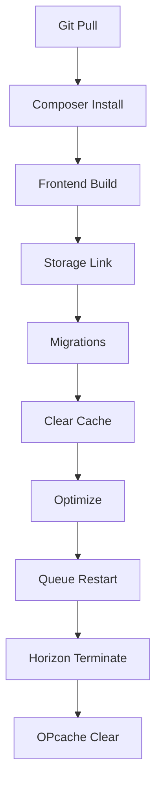

# 🚀 Hosting Laravel Deploy

[](https://packagist.org/packages/arseno25/hosting-laravel-deploy)
[](https://packagist.org/packages/arseno25/hosting-laravel-deploy)
[](https://github.com/arseno25/hosting-laravel-deploy/blob/main/LICENSE.md)

A universal deployment tool for Laravel to any shared hosting or VPS via SSH with GitHub Actions support.

## ✨ Features

- 🔐 **SSH Key Authentication** - Secure deployment using SSH keys (recommended) or password authentication
- 🤖 **GitHub Actions Integration** - Automatically set up CI/CD workflows with GitHub Actions
- 🔗 **GitHub API Integration** - Automatically manage deploy keys and secrets
- ⚙️ **Flexible Deployment Options** - Fresh deployments, storage linking, frontend building
- 👁️ **Dry Run Mode** - Preview deployment scripts before executing
- 🚀 **Automatic Setup** - One-command setup for SSH keys and GitHub secrets
- 🧪 **Testing Integration** - Built-in PHPUnit and PHPStan support
- 💾 **Multiple Cache Management** - Config, route, view, and event caching
- 🔄 **Queue & Horizon Support** - Automatic queue worker restart and Horizon termination

## 📋 Requirements

- PHP 8.1 or higher
- Laravel 10, 11, or 12
- SSH access to your server
- GitHub account with repository access

## 📦 Installation

Install the package via Composer:

```bash
composer require arseno25/hosting-laravel-deploy
```

The package will automatically register its service provider.

## ⚙️ Configuration

Publish the configuration file:

```bash
php artisan vendor:publish --tag="hosting-deploy-config"
```

This will create a `config/hosting-deploy.php` file where you can customize all settings.

### Environment Variables

Add the following variables to your `.env` file:

```env
# ═══════════════════════════════════════════════════════════════
# Server Credentials
# ═══════════════════════════════════════════════════════════════
DEPLOY_HOST=your-server.com          # Server hostname or IP
DEPLOY_PORT=22                        # SSH port (default: 22)
DEPLOY_USERNAME=your-username         # SSH username
DEPLOY_PASSWORD=your-password         # SSH password (optional, use SSH key instead)
DEPLOY_SSH_KEY_PATH=                  # Path to SSH private key (optional)

# ═══════════════════════════════════════════════════════════════
# Deployment Settings
# ═══════════════════════════════════════════════════════════════
DEPLOY_PROJECT_DIR=/path/to/project/on/server
DEPLOY_COMPOSER_FLAGS=--no-dev --optimize-autoloader
DEPLOY_RUN_MIGRATIONS=true
DEPLOY_RUN_SEEDERS=false
DEPLOY_CLEAR_CACHE=true
DEPLOY_OPTIMIZE=true

# ═══════════════════════════════════════════════════════════════
# Deployment Options
# ═══════════════════════════════════════════════════════════════
DEPLOY_FRESH=false                    # Reset database on deploy
DEPLOY_LINK_STORAGE=true              # Create storage link
DEPLOY_BUILD_FRONTEND=true            # Build frontend assets

# ═══════════════════════════════════════════════════════════════
# GitHub Settings (for CI/CD setup)
# ═══════════════════════════════════════════════════════════════
DEPLOY_GITHUB_TOKEN=ghp_your-fine-grained-token-here
DEPLOY_REPO=your-username/your-repo
DEPLOY_DEFAULT_BRANCH=main

# ═══════════════════════════════════════════════════════════════
# Server Connection (optional)
# ═══════════════════════════════════════════════════════════════
DEPLOY_TIMEOUT=30                     # SSH connection timeout in seconds
```

## 🚀 Usage

### Quick Start - One Command Setup & Deploy

The fastest way to get started is using the all-in-one command:

```bash
php artisan hosting-deploy:deploy-and-setup-cicd
```

This command will:
1. ✅ Generate SSH key pair
2. ✅ Add deploy key to your GitHub repository
3. ✅ Store private key locally
4. ✅ Add public key to your server's authorized_keys
5. ✅ Set GitHub secrets for deployment
6. ✅ Create GitHub Actions workflow
7. ✅ Deploy your application

### Deploy via CLI

```bash
# Standard deployment
php artisan hosting-deploy:run

# Fresh deployment (resets database)
php artisan hosting-deploy:run --fresh

# Skip storage linking
php artisan hosting-deploy:run --no-storage

# Skip frontend building
php artisan hosting-deploy:run --no-frontend

# Preview deployment script without executing
php artisan hosting-deploy:run --dry-run

# Show full error output from SSH command (useful for debugging)
php artisan hosting-deploy:run --show-errors
```

### Command Options

| Option | Description |
|--------|-------------|
| `--fresh` | Perform a fresh deployment (resets database with migrate:fresh) |
| `--no-storage` | Skip creating storage link |
| `--no-frontend` | Skip building frontend assets |
| `--dry-run` | Show the deployment script without executing |
| `--show-errors` | Display full error output from SSH commands |

## 🤖 Automatic CI/CD Setup

The `hosting-deploy:setup-cicd` command automates the entire CI/CD setup process:

```bash
php artisan hosting-deploy:setup-cicd

# Force overwrite existing secrets
php artisan hosting-deploy:setup-cicd --force

# Skip checking if deploy key already exists
php artisan hosting-deploy:setup-cicd --skip-key-check
```

### What It Does

1. **🔑 Generate SSH Key Pair** - Creates a unique ED25519 SSH key pair
2. **🔗 Add Deploy Key to GitHub** - Registers the public key as a read-only deploy key
3. **💾 Store Private Key** - Saves the private key securely in `storage/app/deploy/`
4. **🔐 Add to Server** - Adds the public key to your server's `~/.ssh/authorized_keys`
5. **🔒 Set GitHub Secrets** - Encrypts and sets all required secrets
6. **📝 Create Workflow** - Generates the GitHub Actions workflow file

### All-in-One Command

```bash
# Setup CI/CD and deploy in one command
php artisan hosting-deploy:deploy-and-setup-cicd

# With options
php artisan hosting-deploy:deploy-and-setup-cicd --fresh --force --show-errors
```

## 📝 Manual GitHub Actions Setup

If you prefer to set up GitHub Actions manually:

```bash
php artisan hosting-deploy:github-actions
```

This will create a `.github/workflows/hosting-deploy.yml` file in your project.

### Required GitHub Secrets

After running the command, add the following secrets to your GitHub repository:

**For SSH key authentication (recommended):**
- `DEPLOY_HOST` - Your server hostname or IP address
- `DEPLOY_PORT` - SSH port (default: 22)
- `DEPLOY_USERNAME` - SSH username
- `DEPLOY_SSH_KEY` - Your private SSH key content
- `DEPLOY_PROJECT_DIR` - Absolute path to your project on the server

**For password authentication:**
- `DEPLOY_HOST` - Your server hostname or IP address
- `DEPLOY_PORT` - SSH port (default: 22)
- `DEPLOY_USERNAME` - SSH username
- `DEPLOY_PASSWORD` - SSH password
- `DEPLOY_PROJECT_DIR` - Absolute path to your project on the server

## 🔑 GitHub Token Setup

You need a fine-grained Personal Access Token from GitHub with the following permissions:

### Required Permissions

| Permission | Access Level |
|------------|--------------|
| Repository contents | Read and Write |
| Repository deployments | Read and Write |
| Actions | Read and Write (for secrets management) |

### Creating the Token

1. Go to GitHub Settings → Developer settings → Personal access tokens → Fine-grained tokens
2. Click "Generate new token"
3. Give it a descriptive name (e.g., "Laravel Deploy")
4. Set expiration (or no expiration for long-term use)
5. Select only the specific repository you want to deploy
6. Grant the permissions listed above
7. Generate and copy the token
8. Add it to your `.env` file as `DEPLOY_GITHUB_TOKEN`

> ⚠️ **Important:** The token should only have access to the specific repository you want to deploy, not all your repositories.

## 📦 Deployment Process

The deployment process includes the following steps:



### Detailed Steps

1. **📥 Git Pull** - Fetches latest code from your GitHub repository
2. **📦 Composer Install** - Installs PHP dependencies with optimization flags
3. **🎨 Frontend Build** - Installs npm dependencies and builds assets (if enabled)
4. **🔗 Storage Link** - Creates symbolic link to storage directory (if enabled)
5. **🗄️ Migrations** - Runs database migrations (or `migrate:fresh` for fresh deployments)
6. **🧹 Cache Clear** - Clears application caches (config, route, view, event)
7. **⚡ Optimize** - Optimizes application for production
8. **🔄 Queue Restart** - Restarts queue workers (if queue is configured)
9. **🔥 Horizon Terminate** - Terminates Horizon processes (if Horizon is installed)
10. **🧠 OPcache Clear** - Clears OPcache (if available)

## 🔒 Security

This package implements several security best practices:

### SSH Key Authentication

- ✅ **Recommended** - SSH keys are more secure than password authentication
- ✅ **ED25519** - Uses modern ED25519 key algorithm by default
- ✅ **Read-Only Deploy Keys** - Deploy keys in GitHub are read-only
- ✅ **Proper Permissions** - Private keys are stored with 0600 permissions

### GitHub Secrets

- ✅ **LibSodium Encryption** - Secrets are encrypted using LibSodium before sending to GitHub
- ✅ **Fine-Grained Tokens** - Uses GitHub fine-grained personal access tokens
- ✅ **Minimal Permissions** - Tokens only have access to specific repositories
- ✅ **Local Storage** - SSH private keys are stored in `storage/app/deploy/` with proper permissions

### Server Security

- ✅ **Strict Host Key Checking** - Disabled for automation but can be enabled
- ✅ **Connection Timeout** - Configurable timeout to prevent hanging
- ✅ **Error Suppression** - Sensitive information is hidden from error messages

## 🛠️ Configuration File

The published configuration file `config/hosting-deploy.php` contains all available options:

```php
<?php

return [
    /*
    |--------------------------------------------------------------------------
    | Server Configuration
    |--------------------------------------------------------------------------
    */
    'server' => [
        'host' => env('DEPLOY_HOST'),
        'port' => env('DEPLOY_PORT', 22),
        'username' => env('DEPLOY_USERNAME'),
        'password' => env('DEPLOY_PASSWORD'),
        'ssh_key_path' => env('DEPLOY_SSH_KEY_PATH'),
        'timeout' => env('DEPLOY_TIMEOUT', 30),
    ],

    /*
    |--------------------------------------------------------------------------
    | Deployment Configuration
    |--------------------------------------------------------------------------
    */
    'deployment' => [
        'project_dir' => env('DEPLOY_PROJECT_DIR'),
        'composer_flags' => env('DEPLOY_COMPOSER_FLAGS', '--no-dev --optimize-autoloader'),
        'run_migrations' => env('DEPLOY_RUN_MIGRATIONS', true),
        'run_seeders' => env('DEPLOY_RUN_SEEDERS', false),
        'clear_cache' => env('DEPLOY_CLEAR_CACHE', true),
        'optimize' => env('DEPLOY_OPTIMIZE', true),
    ],

    /*
    |--------------------------------------------------------------------------
    | Deployment Options
    |--------------------------------------------------------------------------
    */
    'options' => [
        'fresh' => env('DEPLOY_FRESH', false),
        'link_storage' => env('DEPLOY_LINK_STORAGE', true),
        'build_frontend' => env('DEPLOY_BUILD_FRONTEND', true),
    ],

    /*
    |--------------------------------------------------------------------------
    | GitHub Configuration
    |--------------------------------------------------------------------------
    */
    'github' => [
        'token' => env('DEPLOY_GITHUB_TOKEN'),
        'repo' => env('DEPLOY_REPO'),
        'default_branch' => env('DEPLOY_DEFAULT_BRANCH', 'main'),
    ],

    /*
    |--------------------------------------------------------------------------
    | SSH Configuration
    |--------------------------------------------------------------------------
    */
    'ssh' => [
        'key_type' => env('DEPLOY_SSH_KEY_TYPE', 'ed25519'),
        'key_bits' => env('DEPLOY_SSH_KEY_BITS', 4096),
    ],
];
```

## 🐛 Troubleshooting

### SSH Connection Issues

If you're having trouble connecting to your server:

```bash
# Test SSH connection manually
ssh -p 22 username@your-server.com

# Use --show-errors to see detailed output
php artisan hosting-deploy:run --show-errors

# Use --dry-run to preview the script
php artisan hosting-deploy:run --dry-run
```

### GitHub API Issues

If GitHub API calls are failing:

1. Verify your token has the correct permissions
2. Check that the token hasn't expired
3. Ensure the repo format is `username/repo-name`
4. Try running with `--force` to overwrite existing secrets

### Deployment Failures

Common issues and solutions:

| Issue | Solution |
|-------|----------|
| Permission denied | Check file permissions on server |
| Composer install fails | Increase PHP memory_limit |
| Migration fails | Check database credentials |
| Frontend build fails | Ensure Node.js is installed on server |

## 📚 Available Commands

| Command | Description |
|---------|-------------|
| `hosting-deploy:run` | Deploy application to server |
| `hosting-deploy:setup-cicd` | Set up CI/CD with GitHub Actions |
| `hosting-deploy:github-actions` | Generate GitHub Actions workflow file |
| `hosting-deploy:deploy-and-setup-cicd` | All-in-one setup and deploy |

## 🤝 Contributing

Contributions are welcome! Please feel free to submit a Pull Request.

## 📄 License

The MIT License (MIT). Please see [License File](LICENSE.md) for more information.

## 🙏 Credits

This package is inspired by [thecodeholic/laravel-hostinger-deploy](https://github.com/thecodeholic/laravel-hostinger-deploy).

---

Made with ❤️ by [Arseno25](https://github.com/arseno25)
